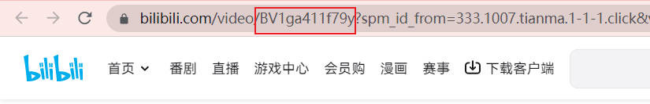
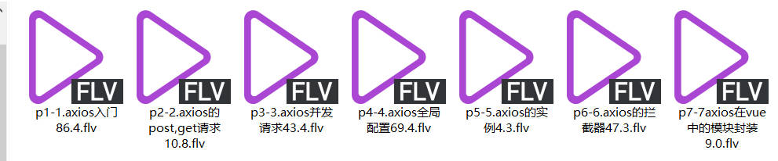
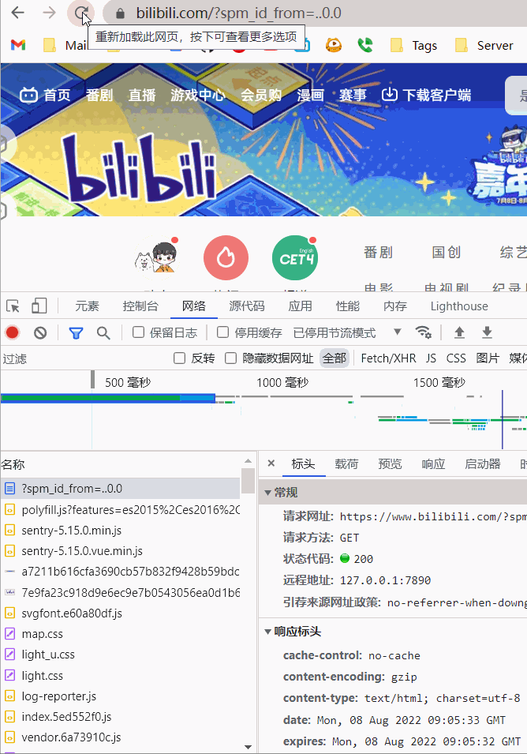

## `Bilibili`视频下载

> 本项目做的比较随意:joy::joy::joy:

### `v1`

**目录为最初的初始版本，代码乱，但是功能能运行:sob:**

> `v1/app.js`

**`bvid`**



```js
// 下载视频，只需要传入bvid即可
let bvid = "BV1QA411b7TR";
// 要下载的集数，如果是多P，那么就是多个集数
// 默认只下载一集
const videoPFrom = 1;
// 填入你需要下载到的视频集数，如果视频只有一集，那么都填 1 就好
const videoPTo = 7;
// 视频集数命名 最好与 videoPFrom 保持一致
let p = 1;
```

**执行**

```sh
node v1/app.js
```

按照代码配置，下载内容如下



>  注意!  如果需要下载多集数视频  最好不要一下之下载太多，会触发B站机制，会封`ip`,那么就得过一会再下载
>
> 最好是将 `videoPFrom`、`videoPTo`、`p`分批次下载，单次下载最好是100内

如果一下子出现了下载失败，需要重新更新一下自己的请求头,替换`v1/app.js`内的全部请求头，如还是不行，那就得等20分钟左右



### `v2`

**目录经过了重构代码，功能也能实现，但是提示不友好，后续有能力会再更改:sob:**

> `v2/app.js`

看自己需要更改

```js
module.exports = {
  // 视频 BVID 号
  bvid: "BV1QA411b7TR",
  // 下载的视频从哪一集开始，默认为 1
  videoPFrom: 1,
  // 下载的视频到哪一集结束，如果视频只有一集，那就跟开始一样都为 1
  videoPTo: 7,
  // 下载视频保存目录 需要自己创建
  videoSavePath: "./videos",
  // b站用户请求头
  headers: {
    accept:  "text/html,application/xhtml+xml,application/xml;q=0.9,image/avif,image/webp,image/apng,*/*;q=0.8,application/signed-exchange;v=b3;q=0.9",
    "accept-language": "zh-CN,zh;q=0.9,en-US;q=0.8,en;q=0.7",
    "cache-control": "max-age=0",
    "sec-ch-ua":
      '"Chromium";v="106", "Google Chrome";v="106", "Not;A=Brand";v="99"',
    "sec-ch-ua-mobile": "?0",
    "sec-ch-ua-platform": '"Windows"',
    "sec-fetch-dest": "document",
    "sec-fetch-mode": "navigate",
    "sec-fetch-site": "same-origin",
    "sec-fetch-user": "?1",
    "upgrade-insecure-requests": "1",
    cookie: "i-wanna-go-back=-1;",
    Referer: "https://www.bilibili.com/",
    "Referrer-Policy": "no-referrer-when-downgrade",
  },
};

```

**执行**

```js
node v2/app.js
```

